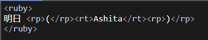
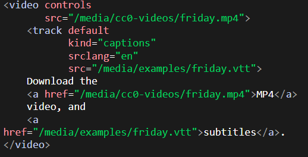
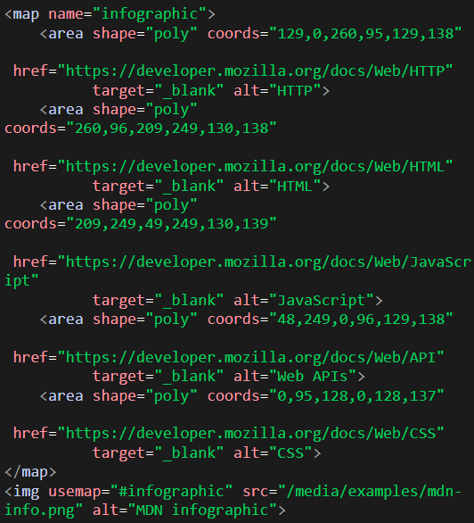
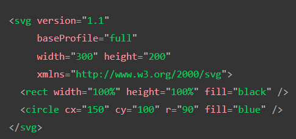
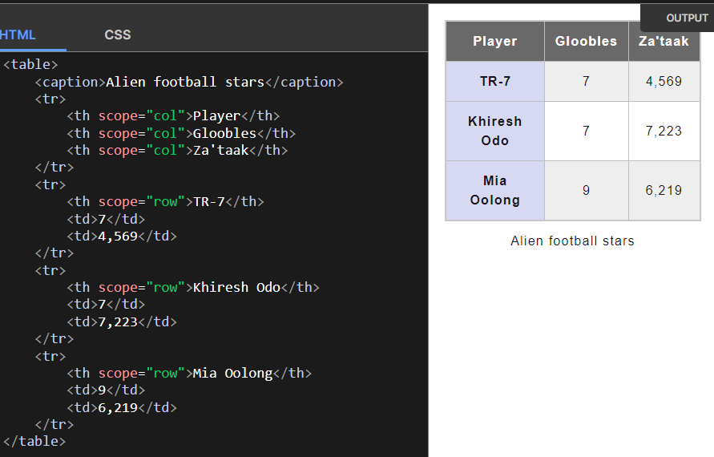
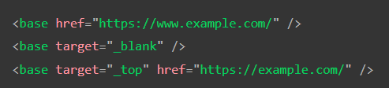
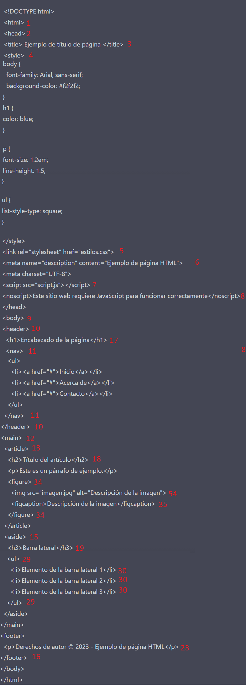

# MP301051.github.io
102 Etiquetas
MP301051.github.io

Rpg hunt 
<!DOCTYPE html>
<h1>HTML</h1>

 Estos son elementos de HTML, el lenguaje de marcado para la creación de páginas web: 

<h2>Definicion de Tags de HTML</h2>

<table style="width:100%">
 <tr>
  <th>Numero</th>
  <th>Palabra</th>
  <th>Definicion</th> 
  <th>Ejemplos</th> 
   </tr>
<tr>
  <td> 1 </td>
  <td> html </td>
  <td> es la etiqueta principal que indica que se trata de un documento HTML. </td>
  <td>  ↓  </td>
</tr>
<tr>
  <td> 2 </td>
  <td> head </td>
  <td> se utiliza para incluir información sobre el documento, como el título y metadatos. </td>
  <td>  ↓  </td>
</tr>
<tr>
  <td> 3 </td>
  <td> title </td>
  <td> define el título de la página web.</td>
  <td>  ↓  </td>
</tr>
<tr>
  <td> 4 </td>
  <td> style </td>
  <td> permite incluir estilos CSS en el documento.</td>
  <td> ↓ </td>
</tr>
<tr>
  <td> 5 </td>
  <td> link </td>
  <td> se usa para enlazar documentos externos, como hojas de estilos o iconos. </td>
  <td> ↓ </td>
</tr>
<tr>
  <td> 6 </td>
  <td> meta </td>
  <td> proporciona información sobre la página, como la descripción o el autor. </td>
  <td> ↓ </td>
</tr>
<tr>
  <td> 7 </td>
  <td> script </td>
  <td> se utiliza para incluir código JavaScript en la página. </td>
  <td> ↓ </td>
</tr>
<tr>
  <td> 8 </td>
  <td> noscript </td>
  <td> muestra un mensaje si el navegador no tiene JavaScript habilitado. </td>
  <td> ↓  </td>
</tr>
<tr>
  <td> 9 </td>
  <td> body </td>
  <td> es la etiqueta que contiene todo el contenido visible de la página. </td>
  <td>  ↓  </td>
</tr>
<tr>
  <td> 10 </td>
  <td> header </td>
  <td> se usa para incluir el encabezado de la página. </td>
  <td>  ↓  </td>
</tr>
<tr>
  <td> 11 </td>
  <td> nav </td>
  <td> se utiliza para incluir la navegación de la página. </td>
  <td>  ↓  </td>
</tr>
<tr>
  <td> 12 </td>
  <td> main </td>
  <td> indica el contenido principal de la página. </td>
  <td>  ↓  </td>
</tr>
<tr>
  <td> 13 </td>
  <td> article </td>
  <td> se utiliza para agrupar contenido relacionado, como un artículo de noticias. </td>
  <td>  ↓  </td>
</tr>
<tr>
  <td> 14 </td>
  <td> section </td>
  <td> se usa para agrupar contenido relacionado, pero de una manera más genérica que el "article". </td>
  <td>  -  </td>
</tr>
<tr>
  <td> 15 </td>
  <td> aside </td>
  <td>  se utiliza para incluir contenido secundario, como publicidad o información adicional. </td>
  <td>  ↓  </td>
</tr>
<tr>
  <td> 16 </td>
  <td> footer </td>
  <td> contiene el pie de página de la página web.  </td>
  <td>  ↓  </td>
</tr>
<tr>
  <td> 17 </td>
  <td> h1 </td>
  <td>  se utilizan para definir encabezados de dnivel 1 </td>
  <td>  ↓  </td>
</tr>
<tr>
  <td> 18 </td>
  <td> h2 </td>
  <td>  se utilizan para definir encabezados de dnivel 2 </td>
  <td> ↓ </td>
</tr>
<tr>
  <td> 19 </td>
  <td> h3 </td>
  <td>  se utilizan para definir encabezados de dnivel 3 </td>
  <td> ↓  </td>
</tr>
<tr>
  <td> 20 </td>
  <td> h4 </td>
  <td>  se utilizan para definir encabezados de dnivel 4 </td>
  <td>  <h4> Ejemplo </h4>  </td>
</tr>
<tr>
  <td> 21 </td>
  <td> h5 </td>
  <td>  se utilizan para definir encabezados de dnivel 5 </td>
  <td>  <h5> Ejemplo </h5>  </td>
</tr>
<tr>
  <td> 22 </td>
  <td> h6 </td>
  <td>  se utilizan para definir encabezados de dnivel 6 </td>
  <td>  <h6> Ejemplo </h6>  </td>
</tr>
<tr>
  <td> 23 </td>
  <td> p </td>
  <td> se utiliza para crear párrafos de texto. </td>
  <td>  ↓  </td>
</tr>
<tr>
  <td> 24 </td>
  <td> br </td>
  <td> inserta un salto de línea. </td>
  <td>  Este     es  </td>
</tr>
<tr>
  <td> 25 </td>
  <td> hr </td>
  <td> crea una línea horizontal. </td>
  <td> 
 Ejemplo 
   </td>
</tr>
<tr>
  <td> 26 </td>
  <td> pre </td>
  <td> se utiliza para mostrar texto preformateado. </td>
  <td> <pre> Ejemplo</pre>   </td>
</tr>
<tr>
  <td> 27 </td>
  <td> blockquote </td>
  <td> se usa para citar un bloque de texto. </td>
  <td>  ↓  </td>
</tr>
<tr>
  <td> 28 </td>
  <td> ol </td>
  <td> se utiliza para crear una lista ordenada. </td>
  <td>  ↓  </td>
</tr>
<tr>
  <td> 29 </td>
  <td> ul </td>
  <td> se utiliza para crear una lista sin orden. </td>
  <td>  ↓  </td>
</tr>
<tr>
  <td> 30 </td>
  <td> li </td>
  <td> se utiliza para crear un elemento de lista </td>
  <td>  ↓
  </td>
</tr>
<tr>
  <td> 31 </td>
  <td> dl </td>
  <td> se utiliza para crear una lista de definiciones. </td>
  <td>  ↓  </td>
</tr>
<tr>
  <td> 32 </td>
  <td> dt </td>
  <td> se utiliza para definir un término. </td>
  <td>  ↓  </td>
</tr>
<tr>
  <td> 33 </td>
  <td> dd </td>
  <td> se utiliza para definir la descripción de un término </td>
  <td>  ↓  </td>
</tr>
<tr>
  <td> 34 </td>
  <td> figure </td>
  <td> se utiliza para agrupar contenido multimedia y su leyenda. </td>
  <td>  ↓  </td>
</tr>
<tr>
  <td> 35 </td>
  <td> figcaption </td>
  <td> se utiliza para agregar una leyenda a una figura. </td>
  <td>    </td>
</tr>
<tr>
  <td> 36 </td>
  <td> div </td>
  <td> se utiliza para agrupar elementos de la página. </td>
  <td>  
Contenido de ejemplo
  </td>
</tr>
<tr>
  <td> 37 </td>
  <td> span </td>
  <td> se utiliza para aplicar estilos a una parte del texto. </td>
  <td>  Texto de ejemplo  </td>
</tr>
<tr>
  <td> 38 </td>
  <td> a </td>
  <td> se utiliza para crear un enlace a otra página o recurso. </td>
  <td>  <a href="https://www.ejemplo.com">Enlace de ejemplo</a>  </td>
</tr>
<tr>
  <td> 39 </td>
  <td> em </td>
  <td> se utiliza para enfatizar el texto. </td>
  <td>  <em>Texto enfatizado</em>  </td>
</tr>
<tr>
  <td> 40 </td>
  <td> strong </td>
  <td> is used to define text with strong importance. The content inside is typically displayed in bold. </td>
  <td>  <strong>Texto en negrita</strong>  </td>
</tr>
<tr>
  <td> 41 </td>
  <td> small </td>
  <td> se utiliza para mostrar texto más pequeño que el tamaño normal. </td>
  <td>  <small>Texto pequeño</small>  </td>
</tr>
<tr>
  <td> 42 </td>
  <td> s </td>
  <td> se utiliza para tachar el texto. </td>
  <td>  <s>Texto tachado</s>  </td>
</tr>
<tr>
  <td> 43 </td>
  <td> q </td>
  <td> se utiliza para citar un texto breve. </td>
  <td>  <q>Cita corta</q>  </td>
</tr>
<tr>
  <td> 44 </td>
  <td> abbr </td>
  <td> se utiliza para abreviaturas. </td>
  <td>  <abbr title="World Wide Web">WWW</abbr>  </td>
</tr>
<tr>
  <td> 45 </td>
  <td> address </td>
  <td> se utiliza para mostrar información de contacto. </td>
  <td>  <address>Dirección de ejemplo</address> </td>
</tr>
<tr>
  <td> 46 </td>
  <td> time </td>
  <td> se utiliza para mostrar fechas y horas. </td>
  <td>  <time>2023-02-18</time>   </td>
</tr>
<tr>
  <td> 47 </td>
  <td> cite </td>
  <td> se utiliza para citar una referencia. </td>
  <td>  <cite>Referencia de ejemplo</cite>  </td>
</tr>
<tr>
  <td> 48 </td>
  <td> bdo </td>
  <td> se utiliza para especificar la dirección del texto (izquierda a derecha o derecha a izquierda). </td>
  <td>  <bdo dir="rtl">Texto de ejemplo</bdo>  </td>
</tr>
<tr>
  <td> 49 </td>
  <td> data </td>
  <td> se utiliza para mostrar datos que se pueden manipular con JavaScript. </td>
  <td>  <data value="123">Valor numérico</data>  </td>
</tr>
<tr>
  <td> 50 </td>
  <td> ruby </td>
  <td> se utiliza para mostrar texto en idiomas asiáticos con su pronunciación en caracteres latinos. </td>
  <td>  <ruby> 漢 <rt>kan</rt> 	</ruby>
  </td>
</tr>
<tr>
  <td> 51 </td>
  <td> rt </td>
  <td> indica la pronunciación de un carácter en idiomas como el japonés. </td>
  <td>    </td>
</tr>
<tr>
  <td> 52 </td>
  <td> rp </td>
  <td> define el contenido a mostrar en navegadores que no soportan la anotación de rubí ("ruby"). </td>
  <td>     </td>
</tr>
<tr>
  <td> 53 </td>
  <td> wbr </td>
  <td> indica un posible punto de ruptura para un salto de línea. </td>
  <td>     </td>
</tr>
<tr>
  <td> 54 </td>
  <td> img </td>
  <td> permite insertar una imagen en una página web. </td>
  <td>  ↓  </td>
</tr>
<tr>
  <td> 55 </td>
  <td> iframe </td>
  <td>  permite insertar una página web dentro de otra página web. </td>
  <td>  <iframe src="https://www.Wikipedia.com"></iframe>  </td>
</tr>
<tr>
  <td> 56 </td>
  <td> object </td>
  <td> permite insertar un objeto multimedia en una página web. </td>
  <td> <object data="video.mp4" width="320" height="240"></object>.   </td>
</tr>
<tr>
  <td> 57 </td>
  <td> param </td>
  <td> se utiliza para pasar parámetros a un objeto multimedia. </td>
  <td>  <param name="autoplay" value="true">  </td>
</tr>
<tr>
  <td> 58 </td>
  <td> video </td>
  <td> permite insertar un archivo de vídeo en una página web. </td>
  <td>  <video src="video.mp4" controls></video>.  </td>
</tr>
<tr>
  <td> 59 </td>
  <td> audio </td>
  <td> permite insertar un archivo de audio en una página web. </td>
  <td>  <audio src="audio.mp3" controls></audio>  </td>
</tr>
<tr>
  <td> 60 </td>
  <td> source </td>
  <td> se utiliza para especificar la fuente de un archivo multimedia en un elemento "video" o "audio". </td>
  <td>  <video controls><source src="video.mp4" type="video/mp4"><source src="video.webm" type="video/webm"></video>.  </td>
</tr>
<tr>
  <td> 61 </td>
  <td> track </td>
  <td>  se utiliza para agregar subtítulos a un archivo de video. </td>
  <td>    </td>
</tr>
<tr>
  <td> 62 </td>
  <td> map </td>
  <td> se utiliza para crear una imagen interactiva con áreas clicables. </td>
  <td>    </td>
</tr>
<tr>
  <td> 63 </td>
  <td> area </td>
  <td> se utiliza junto con map para definir una zona clicable en una imagen. </td>
  <td>    </td>
</tr>
<tr>
  <td> 64 </td>
  <td> canvas </td>
  <td>  se utiliza para dibujar gráficos, animaciones y otros elementos visuales en una página web. </td>
  <td>    </td>
</tr>
<tr>
  <td> 65 </td>
  <td> svg </td>
  <td> permite crear gráficos vectoriales escalables en una página web. </td>
  <td>    </td>
</tr>
<tr>
  <td> 66 </td>
  <td> math </td>
  <td> permite insertar fórmulas matemáticas en una página web. </td>
  <td>    </td>
</tr>
<tr>
  <td> 67 </td>
  <td> table </td>
  <td> se utiliza para crear tablas en una página web. </td>
  <td>    </td>
</tr>
<tr>
  <td> 68 </td>
  <td> caption </td>
  <td> se utiliza para agregar un título a una tabla. </td>
  <td>    </td>
</tr>
<tr>
  <td> 69 </td>
  <td> th </td>
  <td> se utiliza para definir las celdas de encabezado de una tabla. </td>
  <td>    </td>
</tr>
<tr>
  <td> 70 </td>
  <td> tr </td>
  <td> se utiliza para definir las filas de una tabla. </td>
  <td>    </td>
</tr>
<tr>
  <td> 71 </td>
  <td> td </td>
  <td> se utiliza para definir las celdas de datos de una tabla. </td>
  <td>    </td>
</tr>
<tr>
  <td> 72 </td>
  <td> form </td>
  <td> se utiliza para crear un formulario en una página web. </td>
  <td>  <form action="" method="get" class="form-example">
  

    <label for="name">Enter your name: </label>
    <input type="text" name="name" id="name" required>
  

  

    <label for="email">Enter your email: </label>
    <input type="email" name="email" id="email" required>
  

  

    <input type="submit" value="Subscribe!">
  

</form>
  </td>
</tr>
<tr>
  <td> 73 </td>
  <td> fieldset </td>
  <td> se utiliza para agrupar elementos de un formulario. </td>
  <td>  
    <form>
     <fieldset>
      <legend>Cual es el nombre de tu monstruo favorito</legend>

      <input type="radio" id="kraken" name="monster" value="K">
      <label for="kraken">Kraken</label> 

      <input type="radio" id="el monstruo de el lago ness" name="monster" value="S">
      <label for="sasquatch">Sasquatch</label> 

      <input type="radio" id="pies grandes" name="monster" value="M" />
      <label for="mothman">Mothman</label>
    </fieldset>
  </form>
  </td>
</tr>
<tr>
  <td> 74 </td>
  <td> legend </td>
  <td> se utiliza para agregar un título a un grupo de elementos en un formulario. </td>
  <td>  ↑  </td>
</tr>
<tr>
  <td> 75 </td>
  <td> label </td>
  <td> se utiliza para asociar una etiqueta a un elemento de un formulario </td>
  <td>  ↑  </td>
</tr>
<tr>
  <td> 76 </td>
  <td> input </td>
  <td> se utiliza para crear campos de entrada en un formulario. </td>
  <td>  ↑  </td>
</tr>
<tr>
  <td> 77 </td>
  <td> button </td>
  <td> se utiliza para crear botones en un formulario. </td>
  <td>  <button class="favorite styled"
        type="100/100">
    Add to favorites
</button>
  </td>
</tr>
<tr>
  <td> 78 </td>
  <td> select </td>
  <td> se utiliza para proporcionar una lista de opciones para un campo de entrada. </td>
  <td>  <label for="pet-select">Choose a pet:</label>

<select name="pets" id="pet-select">
    <option value="">--Elige una opcion--</option>
    <option value="Perro">perro</option>
    <option value="gato">gato</option>
    <option value="hamster">Hamster</option>
    <option value="perico">perico</option>
    <option value="peces">peces</option>
</select>  
</td>
</tr>
<tr>
  <td> 79 </td>
  <td> datalist </td>
  <td>  es una etiqueta que se utiliza para crear una lista desplegable de opciones para un campo de entrada de texto. Por ejemplo, si se está creando un formulario de registro en línea y se desea que los usuarios puedan seleccionar su país de residencia en un campo de entrada de texto, se puede utilizar la etiqueta "datalist" para proporcionar una lista desplegable de países para que los usuarios puedan elegir.. </td>
  <td>  
<label for="=Helado ">Elige un sabor:</label>
<input list="sabores" id="opciones de helados" name="opciones de helados">

<datalist id="ice-cream-flavors">
    <option value="Chocolate">
    <option value="Coconut">
    <option value="Mint">
    <option value="Strawberry">
    <option value="Vanilla">
</datalist>
  </td>
</tr>
<tr>
  <td> 80 </td>
  <td> optgroup </td>
  <td> se utiliza para agrupar opciones en un elemento "select". </td>
  <td>  <label for="dino-elige">elige un dinosaurio:</label>
<select id="dino-select">
    <optgroup label="Theropods">
        <option>Tyrannosaurus</option>
        <option>Velociraptor</option>
        <option>Deinonychus</option>
    </optgroup>
    <optgroup label="Sauropods">
        <option>Diplodocus</option>
        <option>Saltasaurus</option>
        <option>Apatosaurus</option>
    </optgroup>
</select>  </td>
</tr>
<tr>
  <td> 81 </td>
  <td> option </td>
  <td> se utiliza para definir una opción en un elemento "select" o "datalist".  </td>
  <td>  ↑  </td>
</tr>
<tr>
  <td> 82 </td>
  <td> textarea </td>
  <td> se utiliza para crear un campo de entrada de texto en un formulario. </td>
  <td>  <label for="story">Para que sirve:</label>

<textarea id="story" name="story"
          rows="5" cols="33">
Esto es para texto
</textarea>
 </td>
</tr>
<tr>
  <td> 83 </td>
  <td> output </td>
  <td> se utiliza para mostrar el resultado de un cálculo en un formulario. </td>
  <td>  
<form oninput="result.value=parseInt(a.value)+parseInt(b.value)">
  <input type="range" id="b" name="b" value="50" /> +
  <input type="number" id="a" name="a" value="10" /> =
  <output name="result" for="a b">60</output>
</form>
  </td>
</tr>
<tr>
  <td> 84 </td>
  <td> progress </td>
  <td> se utiliza para mostrar el progreso de una tarea en un formulario. </td>
  <td>   
<label for="file">progreso:</label>

<progress id="file" max="100" value="70"> 70% </progress>
 </td>
</tr>
<tr>
  <td> 85 </td>
  <td> meter </td>
  <td>  se utiliza para mostrar una medición en un rango específico en un formulario. </td>
  <td>  <label for="fuel">Nivel de bateria:</label>

<meter id="fuel"
       min="0" max="100"
       low="33" high="66" optimum="80"
       value="50">
    at 50/100
</meter>
  </td>
</tr>
<tr>
  <td> 86 </td>
  <td> details </td>
  <td> se utiliza para crear un elemento plegable que muestra u oculta contenido. </td>
  <td>  <detalles>
    
Detalles

    Se usa para pequeñas notas.

  </td>
</tr>
<tr>
  <td> 87 </td>
  <td> summary </td>
  <td> se utiliza para agregar un título a un elemento plegable creado con "details". </td>
  <td>  

    
 Esto es para poner datos para que se demuestre en su pagina web.

  </td> 
</tr>
<tr>
  <td> 88 </td>
  <td> menu </td>
  <td> se utiliza para crear un menú de opciones. </td>
  <td>  

    <a href="#">Que tu quiere de el picapollo?</a>
    <menu>
        <li><button id="save">Picapollo</button></li>
        <li><button id="share">Pechurina </button></li>
    </menu>

  </td>
</tr>
<tr>
  <td> 89 </td>
  <td> menuitem </td>
  <td> se utiliza para agregar una opción a un menú creado con "menu". </td>
  <td>    </td>
</tr>
<tr>
  <td> 90 </td>
  <td> mark </td>
  <td> se utiliza para resaltar o destacar una parte del texto en una página web. Suele aparecer en amarillo o en otro color llamativo para llamar la atención del usuario. <td>
  <td>  
 Cuantas patas tiene un Gato: Una, Dos, Tres <mark>Cuatro</mark> y una cola.

</td> 
</tr>
<tr>
  <td> 91 </td>
  <td> abbr </td>
  <td> representa una abreviatura o un acrónimo. Cuando incluya una abreviatura o un acrónimo, proporcione una expansión completa del término en texto sin formato la primera vez que lo use, junto con <abbr> para marcar la abreviatura. Esto informa al usuario qué significa la abreviatura o sigla.. </td>
  <td>  
Puede utilizar <abbr>CSS</abbr> para aplicar estilo a su <abbr>HTML</abbr>. Con las hojas de estilo, puede mantener la capa de presentación <abbr>CSS</abbr> y la capa de contenido <abbr>HTML</abbr> separadas. Esto se llama "separación de preocupaciones".
  </td>
</tr>
<tr>
  <td> 92 </td>
  <td> rtc </td>
  <td> se utiliza junto con la etiqueta <rt> para agrupar el texto de anotación a la derecha de un carácter o conjunto de caracteres en un idioma asiático.</td>
  <td> 
<ruby xml:lang="zh-Hant" style="ruby-position: under;">
    <rbc>
        <rb>馬</rb><rp>(</rp><rt>mǎ</rt><rp>)</rp>
        <rb>來</rb><rp>(</rp><rt>lái</rt><rp>)</rp>
        <rb>西</rb><rp>(</rp><rt>xī</rt><rp>)</rp>
        <rb>亞</rb><rp>(</rp><rt>yà</rt><rp>)</rp>
    </rbc>
    <rtc xml:lang="en" style="ruby-position: over;">
        <rp>(</rp><rt>Malaysia</rt><rp>)</rp>
    </rtc>
</ruby>
   </td>
</tr>
<tr>
  <td> 93 </td>
  <td> section </td>
  <td> se utiliza para dividir el contenido de una página web en secciones temáticas. Esta etiqueta se utiliza para estructurar el contenido de una página web y para facilitar su navegación.</td>
  <td>   
<h1>Este es un ejemplo </h1>
<section>
    <h2>Como se utiliza</h2>
    
Esto se utiliza de forma para dividir la pagina, en diferentes formas

</section>

<section>
    <h2>Ejemplo</h2>
    
De esta forma 

</section>

 </td> 
</tr>
<tr>
  <td> 94 </td>
  <td>  del </td>
  <td> representa un intervalo de texto que se ha eliminado de un documento. Esto se puede usar al representar "control de cambios" o información de diferencias de código fuente, por ejemplo. El <ins> elemento se puede utilizar para el propósito opuesto: indicar el texto que se ha agregado al documento</td>
  <td>  <blockquote>
    No ahi <del>nada</del> <ins>ningun codigo</ins> bueno o malo, pero <del>pensar</del> <ins>correrlo</ins> lo hace.
</blockquote>
  </td>
</tr>
<tr>
  <td> 95 </td>
  <td> dfn </td>
  <td>elemento se utiliza para indicar el término que se define en el contexto de una frase u oración de definición.El elemento antepasado, el "p" "dt""dd" / emparejamiento, o el <section> antepasado más cercano del <dfn> elemento, se considera la definición del término.</td>
  <td>  
 un <dfn id="def-validator">validator</dfn> Este programa chequea por errores syntax en codigos o documentos.
  </td>  
</tr>
<tr>
  <td> 96 </td>
  <td> u </td>
  <td>  representa un intervalo de texto en línea que debe representarse de una manera que indique que tiene una anotación no textual. Esto se representa de forma predeterminada como un simple subrayado sólido, pero puede modificarse mediante CSS. .</td>
  <td>  
Puedes usarlo para resaltar <u>los errores</u> ortograficos,para que la <u>correcion</u>. 
 </td> 
</tr>
<tr>
  <td> 97 </td>
  <td> slot </td>
  <td> se utiliza para definir una ranura en un componente web personalizado donde se puede insertar contenido dinámicamente. Esta etiqueta se utiliza para crear componentes web reutilizables y personalizables.</td>
  <td>    </td>  
</tr>
<tr>
  <td> 98 </td>
  <td> dialog </td>
  <td> se utiliza para crear un cuadro de diálogo o ventana emergente en una página web. Esta etiqueta se utiliza para mostrar información adicional, solicitar confirmación del usuario o para realizar una acción específica. </td>
  <td>  <dialog open>
  
Saludos, Como se encuentra en el dia de Hoy?

  <form method="dialog">
    <button>Excelente!!!</button>
  </form>
</dialog>  </td>  
</tr>
<tr>
  <td> 99 </td>
  <td> acronym </td>
  <td> se utiliza para definir un acrónimo en una página web. Esta etiqueta se utiliza para proporcionar una definición breve y precisa de un término técnico o especializado. </td>
  <td> 
 
   The <acronym title="World Wide Web">WWW</acronym> es solo un componente del internet. 
 
 </td>
 </tr>
<tr>
  <td> 100 </td>
  <td> applet </td>
  <td>  se utilizaba en versiones anteriores de HTML para agregar applets de Java a una página web. Sin embargo, esta etiqueta ya no se utiliza en HTML5 debido a las preocupaciones de seguridad asociadas con la tecnología Java.</td>
  <td>  
<applet
  code="game.class"
  align="left"
  archive="game.zip"
  height="250"
  width="350">
  <param name="difficulty" value="easy" />
  
Necesitas java para jugar.

</applet>
  </td>  
</tr>
<tr>
  <td> 101 </td>
  <td> b </td>
  <td> se utiliza para enfatizar un texto en negrita. Esta etiqueta se utiliza para resaltar una palabra o una frase importante en el contenido de una página web.</td>
  <td>  
<b> One Piece (Wan Pīsu)</b>. Es un Manga y Anime del autor <b>Eiichirō Oda</b> que narra la historia de un mundo de piratas donde todos buscan una meta: el One Piece, para convertirse en el Rey de los Piratas.
  </td>
 </tr>
<tr>
  <td> 102 </td>
  <td> base </td>
  <td> se utiliza para especificar la URL base para todos los enlaces en una página web. Esta etiqueta se utiliza para facilitar la navegación del usuario y para mejorar la eficiencia de la carga de la página.</td>
  <td>    </td>
</tr>
</table>

<h2> Ejemplos: </h2>

</html>
